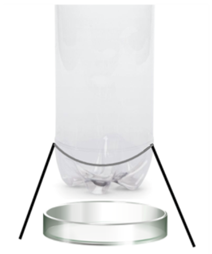
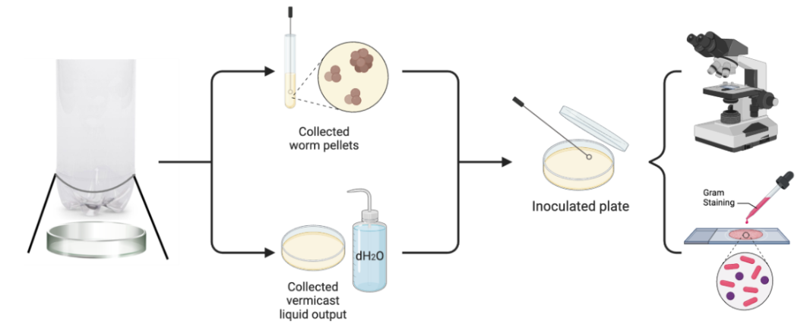
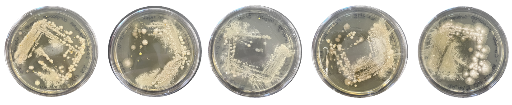
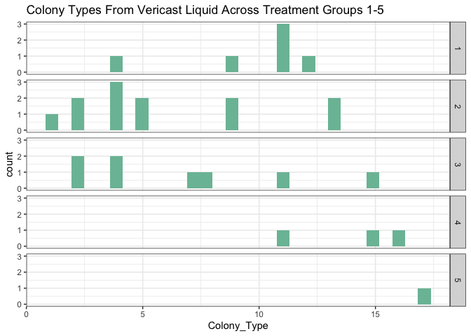
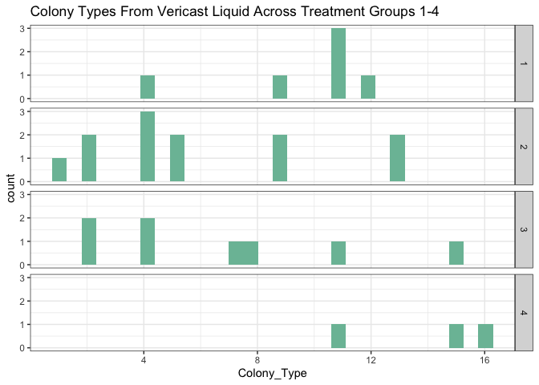
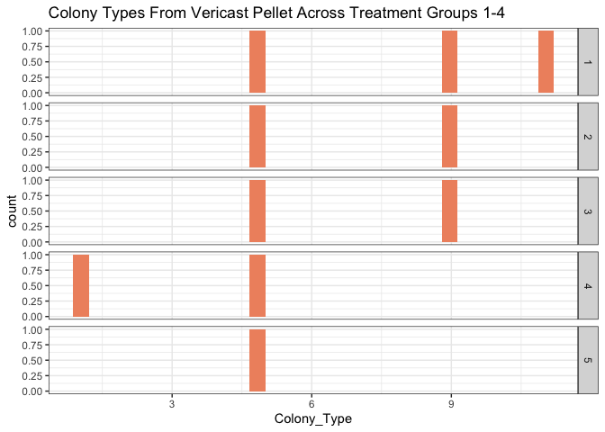
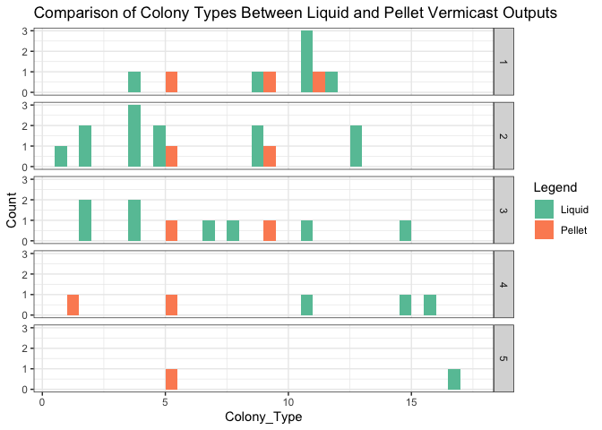
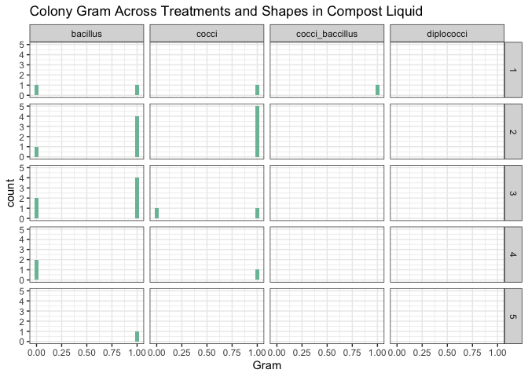
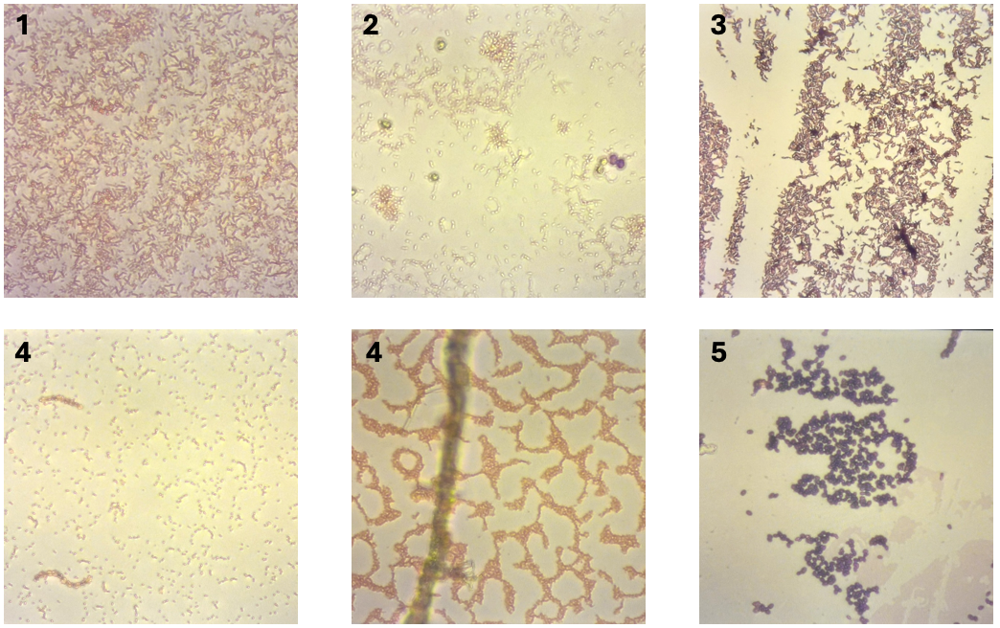

<style type="text/css">
p.caption {
  font-size: 18px;
}
</style>

# **AFFILIATIONS** {-}
^1^Mount Allison University, New Brunswick, Canada  
* corresponding author


# **ACKNOWLEDGEMENTS** {-}
DAC was supported by the Canada Research Chairs.
Lisa Barney offered support and resources throughout the project


# **INTRODUCTION**

## Background   
Vermicasting is a composting method that utilizes worms to break down organic waste into nutrient-rich soil. The microorganisms present in the worms' digestive systems, as well as those in the organic waste, facilitate this process. This practice enhances the end product's quality and increases its biodiversity, positively impacting soil health. 

There are several strategies for introducing microbial biodiversity into vermicast systems. One method involves adding pre-composted materials or forest soil to the system. However, there is ongoing debate about the ideal timing for introducing this additional substrate. 

## Research Question   
Does introducing microorganisms to a vermicast system increase the microbial biodiversity of the final product? If so, what is the optimal time for their introduction? 

## Hypothesis   
Adding pre-composted material to vermicast systems at any stage of development will lead to a product with greater microbial biodiversity. 

## Prediction   
Vermicast systems with additional microorganisms introduced earlier will break down organic waste faster than vermicast systems that had them introduced later.


# **MATERIALS & METHODS** 

## Set Chunk Options
Formatted display of content from .md file on GitHub site.
Upon knitr figures will be saved to 'Figs/'.


## Load Packages


## InLine Citations of Software Packages Added Through the 'citr' Option Under 'Addins'.  
The cited items must be in the .bib file saved in the .Rproj folder; in this case RPackageCitations.bib, generated by exporting a library to .bib from Zotero. Upon export click the 'Keep Updated' button in the BetterBibTex menu. If new citations are added to Zotero they will be pushed through to update the exported .bib file in the .Rproj folder.
[@bryanGooglesheets4AccessGoogle2021;@mcgowanGoogledriveInterfaceGoogle2020; @wickhamTidyverseEasilyInstall2017]

## Data Import From Google Sheet
Data in a Google Sheet is more generic than a project-specific .csv edited and saved locally and pushed to GitHub. The Google Sheet package interface was used, with guidance from Dr. Campbell.

## Connect to Google Account
The Google account that contained the data-sheets was de-authorized. This allowed universal access to the raw data sheet.Then retrieve data sheet from where it's stored on Google Drive.

``` r
#Instead of sending a token, Google Sheets4 will send an API key. This can be used to access public resources for which no Google sign-in is required.

# Deauthorize to access public sheets
gs4_deauth()

#URL of the Google Sheet so that it is available to anyone
googlesheet_url <- "https://docs.google.com/spreadsheets/d/1VpTn7voQ0889RoEloQtZFyVJyPMIRbACklrrquOiC7c/edit?usp=sharing"
```

## Accessing Data From Google Sheets
Below are the commands necessary to import the open source data from the vermicast project into R studio.

``` r
PhysChemL <- read_sheet(googlesheet_url, sheet = "PhysChemL")
PhysChemP <- read_sheet(googlesheet_url, sheet = "PhysChemP")
```

## Vermicast Setup



## Treatment Groups
1. Worms and apples
2. Worms, apples and dirt
3. Worms, apples and dirt one week before
4. Worms, apples and dirt one week after
5. Dirt and apples

## Vermicast Pellet and Liquid Output Analyzation and Characterization 

<div class="figure">

<p class="caption">(\#fig:methods_overview) Schematic of vermicast culturing process for worm pellet liquid output. Colony analysis of colonies using microscopy and gram-staining. Created using BioRender.com.</p>
</div>

## Examples of Innoculated Petri Dishes From Vermicast Outputs

<div class="figure">

<p class="caption">(\#fig:plate_examples) Examples of innoculated vermicast liquid outputs for treatment groups 1-5 from left to right, respectively. Vermicast output was cultured on triptic-soy agar plates.</p>
</div>


# **RESULTS**


# Biodivesity of Vermicast Liquid & Pellet Output

## Biodivesity of Vermicast Liquid Output


``` r
PhysChemL |>
  ggplot() +
  geom_histogram(aes(Colony_Type), fill = "#7bbea5") +
  facet_grid(rows = vars(Treatment)) +
  theme_bw() +
  labs(
    title = "Colony Types From Vericast Liquid Across Treatment Groups 1-5"
  )
```

<!-- -->
Figure 4. Identification of colony types from vermicast liquid of treatment groups 1-5 from microscopy observations. Identifies treatment 5 as a potential outlier due to fungal contamination. 

According to Figure 4, treatment 5 was identified as an outlier due to the presence of a fungus that covered most of the colonies, rendering them inaccessible. To enhance the visualization of the similarities and differences in colony biodiversity across the treatments, treatment 5 was excluded from the analysis.

## Biodivesity of The Vermicast Liquid Output of Treatment Groups 1-4


``` r
PhysChemL |>
  filter(Treatment != 5) |>
  ggplot() +
  geom_histogram(aes(Colony_Type), fill = "#7bbea5") +
  facet_grid(rows = vars(Treatment)) +
  theme_bw() +
  labs(
    title = "Colony Types From Vericast Liquid Across Treatment Groups 1-4"
  )
```

<!-- -->

Figure 5. Identification of colony types from vermicast liquid outputs of treatment groups 1-4 from microscopy observations. 

## Biodivesity of The Vermicast Pellet Output of Treatment Groups 1-4


``` r
PhysChemP |>
  ggplot() +
  geom_histogram(aes(Colony_Type),fill = "#ef926e" ) +
  facet_grid(rows = vars(Treatment)) +
  theme_bw() +
  labs(
    title = "Colony Types From Vericast Pellet Across Treatment Groups 1-4"
  )
```

<!-- -->

Figure 6. Identification of colony types from vermicast pellet outputs of treatment groups 1-5 from microscopy observations. The results indicate minimal diversity between colony types among the treatments.

The main product of a vermicast system is the pellet formed through the decomposition carried out by microorganisms in the worm's digestive tract. Tests were performed to evaluate the bacterial colonies' biodiversity in the pellets across treatment groups 1-5. Figure 6 indicates minimal diversity between colony types among the treatments.

## Comparasion of Vermicast Liquid Output and Vermicast Pellet Output


``` r
# Combine two dataframe
PhysChem_combined <- bind_rows(
  PhysChemP %>% mutate(Source = "Pellet"),
  PhysChemL %>% mutate(Source = "Liquid")
)

# Plot the data
  ## scale_fill_brewer(palette = "______"): set color for the graph
  ## position = "dodge" : put the columns side-by-side
  ## binwidth = ____ : changing size of the columns
ggplot(PhysChem_combined) +
  geom_histogram(aes(x = Colony_Type, fill = Source), position = "dodge", binwidth = 1) +
  facet_grid(rows = vars(Treatment)) +
  theme_bw() +
  scale_fill_brewer(palette = "Set2") +
  labs(
    title = "Comparison of Colony Types Between Liquid and Pellet Vermicast Outputs",
    x = "Colony_Type",
    y = "Count",
    fill = "Legend"
  )
```

<!-- -->
Figure 7. Identification of colony types for liquid and pellet vermicast outputs of treatment groups 1-5 from microscopy observations.

Following the initial observation that bacterial colonies exhibited reduced biodiversity in the pellets compared to the liquid outputs, it was determined that a comparative analysis of the results across treatments would be beneficial. Figure 7 illustrates that microbial biodiversity is more pronounced in the colonies derived from the liquid of each treatment than in the pellet vermicast. This finding suggests that the microbial diversity present in vermicast systems is not sourced from the worms' gut.


# Biodivesity of Colonies

## Analysis of Bacterial Colonies Using Microscopy

Microscopy was used to identify differences between bacterial colonies. This method allowed us to verify whether colonies that shared a similar appearance were indeed the same type of bacteria by analyzing their shapes and conducting gram-staining tests.


``` r
PhysChemL |>
  ggplot() +
  geom_histogram(aes(Plate_Colony),fill = "#7bbea5") +
  facet_grid(rows = vars(Treatment)) +
  theme_bw() 
```

<!-- -->

Figure 12. Number of colonies and bacteria types of each colonies for vermicast liquid output across treatment groups 1-5. Results were observed using microscopy.

## Analysis of Colony Shapes Using Microscopy

Examining the different sizes and shapes of the colonies provides insights into the different forms of bacteria present after each treatment. This analysis increases our understanding of the biodiversity of bacteria in each colony.


``` r
PhysChemL |>
  ggplot() +
  geom_histogram(aes(Shape), stat="count", fill = "#7bbea5") +
  facet_grid(rows = vars(Treatment)) +
  theme_bw()+
  labs(
    title = "Bacteria Shapes of Vermicast Liquid From Treatment Groups 1-5"
  )
```

<!-- -->

Figure 8. Comparison of colony shapes among treatment groups 1-5 from vermicast liquid output. Results were observed using microscopy.

## Analysis of Bacteria Sizes Using Microscopy


``` r
PhysChemL |>
  ggplot() +
  geom_histogram(aes(Size_um),fill = "#7bbea5") +
  facet_grid(rows = vars(Treatment)) +
  theme_bw() +
  labs(
    title = "Colony Size Across Treatments in Compost Liquid"
  )
```

<!-- -->

Figure 9. Comparison of colony sizes among treatment groups 1-5 from vermicast liquid output. Results were observed using microscopy.

## Analysis of Releationship Between Bacteria Size and Shapes Between Treatment Groups


``` r
PhysChemL |>
  ggplot() +
  geom_histogram(aes(Size_um), fill = "#7bbea5") +
  facet_grid(rows = vars(Treatment), cols = vars(Shape)) +
  theme_bw() +
  labs(
    title = "Comparison of Bacteria Size & Shape From Treatments 1-5 of Vermicast Liquid"
  )
```

<!-- -->

Figure 10. Comparison of different size (um) and shapes among treatment groups 1-5 from vermicast liquid output. Results were observed using microscopy.

Figure 10 displays the different sizes and shapes of bacteria found in each treatment group. It indicates that while some colonies share similar shapes, they differ in size. This suggests that although certain colonies may look alike, they actually consist of different types of bacteria.


# Gram Staining

## Analysis of Gram Stained Colonies Across Treatments


``` r
PhysChemL |>
  ggplot() +
  geom_histogram(aes(Gram),fill = "#7bbea5") +
  facet_grid(rows = vars(Treatment)) +
  theme_bw() +
  labs(
    title = "Colony Gram Across Treatments of Compost Pallet "
  )
```

<!-- -->

Figure 11.


## Analysis of Gram Stained Colonies and Bacteria Shape


``` r
PhysChemL |>
  ggplot() +
  geom_histogram(aes(Gram),fill = "#7bbea5") +
  facet_grid(rows = vars(Treatment), cols = vars(Shape)) +
  theme_bw() +
  labs(
    title = "Colony Gram Across Treatments and Shapes in Compost Liquid"
  )
```

<!-- -->

Figure 12.


## Analysis of Gram Stained and Colony Type


``` r
## scale_x_continuous(breaks = c(a,b)) : in which set x-axis to display specific numbers value
PhysChemL |>
  ggplot() +
  geom_histogram(aes(Gram),fill = "#7bbea5", binwidth = 0.2) +
  facet_grid(rows = vars(Treatment), cols = vars(Colony_Type)) +
  scale_x_continuous(breaks = c(0, 1)) +
  theme_bw()+
  labs(
    title = "Colony Gram Across Treatments and Colony Types of Compost Liquid"
  )
```

<!-- -->
Figure 13. Identification of gram staining (0 = negative, 1 =positive) for the different colony types from vermicast liquid output for treatment groups 1-5. Results were observed using microscopy.

Figure 13 shows the gram positive or negative stains observed in the colonies of treatment groups 1-5. This allows us to determine if the colonies maintain consistent gram types across treatments. If not, they are likely to represent different colonies.

## Example of Gram Stains from Treatment Groups 1-5

<div class="figure">

<p class="caption">(\#fig:gram_stain_examples) Examples of gram stains from treatment groups 1-5 at 40x magnification using microscopy.</p>
</div>

Figure 14 shows examples of gram stains from treatment groups 1-5. This includes two examples from treatment group 4, demonstrating contrasting results between colonies of the same treatment group. This indicates that there were gram positive and negative bacteria present in the different colony types and treatment groups.


# **CONCLUSIONS**


# **REFERENCES**


