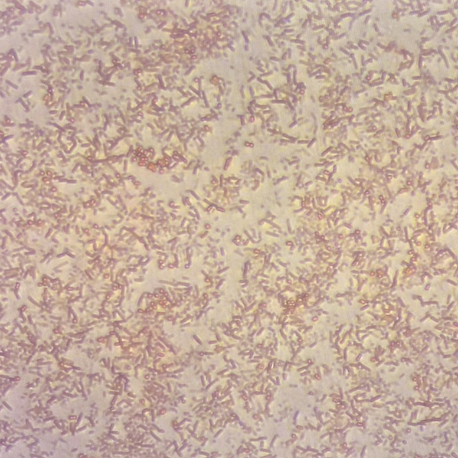
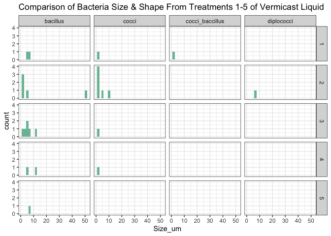
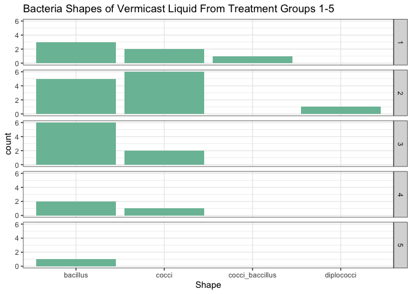

<style type="text/css">
p.caption {
  font-size: 18px;
}
</style>


# Affiliations {-}
^1^Mount Allison University, New Brunswick, Canada  

*corresponding author  

# Acknowledgements {-}
Brackets minus after heading excludes heading from numbering.
DAC was supported by the Canada Research Chairs.
Lisa Barney offered support and resources throughout the project

# Overview
File import functions read files into R objects, commonly data frames. 

# Materials & Methods  
## Set chunk options
Formatted display of content from .md file on GitHub site.
Upon knitr figures will be saved to 'Figs/'


## Load packages


## InLine Citations of software packages added through the 'citr' option under 'Addins'.  
The cited items must be in the .bib file saved in the .Rproj folder; in this case RPackageCitations.bib, generated by exporting a library to .bib from Zotero.  Upon export click the 'Keep Updated' button in the BetterBibTex menu.  If new citations are added to Zotero they will be pushed through to update the exported .bib file in the .Rproj folder.
[@bryanGooglesheets4AccessGoogle2021;@mcgowanGoogledriveInterfaceGoogle2020; @wickhamTidyverseEasilyInstall2017]

## Source locally saved functions stored in a text file
A text file of functions is a preliminary step towards a package, to re-use functions without repasting them.

## Set Project Variables  
Try to set all user-defined variables near top of .Rmd, in one place, to avoid or limit editing of downstream code.
Assigning project-specific values to generic variables helps with re-use of code.

``` r
DataIn <- "XXXX"
TargetFile <- "YYYY"
```


# Import Data from a GoogleSheet
Data in a GoogleSheet is more generic than a project-specific .csv edited and saved locally and pushed to GitHub.
The GoogleSheet package interface can be tricky.
Repeatedly reading from GoogleDrive can provoke a throttle from Google.


# Connect to google account
The Google account that contained the data-sheets was de-authorized. This allowed universal access to the raw data sheet.Then retrieve data sheet from where it's stored on google drive.

``` r
#Instead of sending a token, googlesheets4 will send an API key. This can be used to access public resources for which no Google sign-in is required. 
googlesheets4::gs4_deauth()

#URL of the GoogleSheet so that it is available to anyone
googlesheet_url <- "https://docs.google.com/spreadsheets/d/1VpTn7voQ0889RoEloQtZFyVJyPMIRbACklrrquOiC7c/edit?usp=sharing"
```


## Accessing sheets

``` r
PhysChemL <- read_sheet(googlesheet_url, sheet = "PhysChemL")
PhysChemP <- read_sheet(googlesheet_url, sheet = "PhysChemP")
```

# Analysis the biodiversities of the different colonies within the treatments


<div class="figure">

<p class="caption">(\#fig:methods)Worm Composting Method Setup.</p>
</div>

<div class="figure">

<p class="caption">(\#fig:analysis)Gram Stain.</p>
</div>

## Biodivesity of the vermicast liquid output


``` r
PhysChemL |>
  ggplot() +
  geom_histogram(aes(Colony_Type), fill = "#7bbea5") +
  facet_grid(rows = vars(Treatment)) +
  theme_bw() +
  labs(
    title = "Colony Type Across Treatments in Compost Liquid"
  )
```

<!-- -->


Treatment 5 was an outlier, as it had a fungus covering most of the colonies, making them inaccessible. A secondary fgures excluding it was created to better visualize the similarities and diffrences of bacterial colony biodivesrsity between treatments. 

## biodivesity of the vermicast liquid output, removing the outlier

``` r
PhysChemL |>
  filter(Treatment != 5) |>
  ggplot() +
  geom_histogram(aes(Colony_Type), fill = "#7bbea5") +
  facet_grid(rows = vars(Treatment)) +
  theme_bw() +
  labs(
    title = "Colony Type Across Treatments in Vermicast Liquid Output"
  )
```

<!-- -->

## Comparasion of Vermicast liquid output and Vermicast solids Output


``` r
PhysChemP |>
  ggplot() +
  geom_histogram(aes(Colony_Type),fill = "#ef926e" ) +
  facet_grid(rows = vars(Treatment)) +
  theme_bw() +
  labs(
    title = "Colony Types Across Treatments of Compost Pellet"
  )
```

<!-- -->

The solid vermicast is the main product of a functioning vermicast system. These were also tested for the biodiversity between colonies. It was found there was little biodiversity of bacterial colonies between treatments.


``` r
# Combine two dataframe
PhysChem_combined <- bind_rows(
  PhysChemP %>% mutate(Source = "Pellet"),
  PhysChemL %>% mutate(Source = "Liquid")
)

# Plot the data
  ## scale_fill_brewer(palette = "______"): set color for the graph
  ## position = "dodge" : put the columns side-by-side
  ## binwidth = ____ : changing size of the columns
ggplot(PhysChem_combined) +
  geom_histogram(aes(x = Colony_Type, fill = Source), position = "dodge", binwidth = 1) +
  facet_grid(rows = vars(Treatment)) +
  theme_bw() +
  scale_fill_brewer(palette = "Set2") +
  labs(
    title = "Comparison of Colony Types between Compost Pellet and Liquid ",
    x = "Colony_Type",
    y = "Count",
    fill = "Figure"
  )
```

<!-- -->

After the initial realization that there was less biodiversuty in bacterial colonies between treatments than the liquid, it was determined to be beneficial to compare the results between treatments. This graphs supports that there is more biodiversity in colonies from the liquid of each treatment than from the solid vermicast. 
This suggests that the microbial biodiversity from vermicast systems is nt deriving from the gut of the worm.


# Analysis of bacterial colonies using microscopy

To futher determine diffrences between bacteria types, microscopy was used. This helped t determine wether colonies that had similar appearance were actually the same bacteria through analysis of shape and gram-staining.

## Analysis of bacterial shape


``` r
PhysChemL |>
  ggplot() +
  geom_histogram(aes(Size_um), fill = "#7bbea5") +
  facet_grid(rows = vars(Treatment), cols = vars(Shape)) +
  theme_bw() +
  labs(
    title = "Bacteria Size Across Different Shapes and Treatments in Compost Liquid"
  )
```

<!-- -->


## Analysis of the diffrent shapes under the microscopes, with removal of the outlier


``` r
PhysChemL |>
  filter(Treatment != 5) |>
  ggplot() +
  geom_histogram(aes(Shape), stat="count", fill = "#7bbea5") +
  facet_grid(rows = vars(Treatment)) +
  theme_bw()+
  labs(
    title = "Colony Shapes Across Treatments in Compost Liquid"
  )
```

<!-- -->

##Analysis of the diffrent shapes and sizes of bacteria present in each treatment


``` r
PhysChemL |>
  ggplot() +
  geom_histogram(aes(Size_um),fill = "#7bbea5") +
  facet_grid(rows = vars(Treatment), cols = vars(Shape)) +
  theme_bw() +
  labs(
    title = "Bacteria Size Across Different Shapes and Treatments in Compost Liquid"
  )
```

<!-- -->


``` r
PhysChemL |>
  ggplot() +
  geom_histogram(aes(Size_um),fill = "#7bbea5") +
  facet_grid(rows = vars(Treatment)) +
  theme_bw() +
  labs(
    title = "Colony Size Across Treatments in Compost Liquid"
  )
```

<!-- -->


``` r
PhysChemL |>
  ggplot() +
  geom_histogram(aes(Plate_Colony),fill = "#7bbea5") +
  facet_grid(rows = vars(Treatment)) +
  theme_bw() 
```

<!-- -->
This graph shows how many colonies were taken from each plate, and how many bacteria types were in each colony (liquid)


``` r
PhysChemL |>
  ggplot() +
  geom_histogram(aes(Gram),fill = "#7bbea5") +
  facet_grid(rows = vars(Treatment), cols = vars(Shape)) +
  theme_bw() +
  labs(
    title = "Colony Gram Across Treatments and Shapes in Compost Liquid "
  )
```

<!-- -->

``` r
PhysChemL |>
  ggplot() +
  geom_histogram(aes(Gram),fill = "#7bbea5") +
  facet_grid(rows = vars(Treatment)) +
  theme_bw() +
  labs(
    title = "Colony Gram Across Treatments of Compost Pallet "
  )
```

<!-- -->

``` r
## scale_x_continuous(breaks = c(a,b)) : in which set x-axis to display specific numbers value
PhysChemL |>
  ggplot() +
  geom_histogram(aes(Gram),fill = "#7bbea5", binwidth = 0.2) +
  facet_grid(rows = vars(Treatment), cols = vars(Colony_Type)) +
  scale_x_continuous(breaks = c(0, 1)) +
  theme_bw()+
  labs(
    title = "Colony Gram Across Treatments and Colony Types of Compost Liquid"
  )
```

<!-- -->
This graph shows us the different gram stains across colonies in the treatment types, which let us see if the colonoes have consistent gram types across treatments. If they don't, they were likely different colonies. 

This next section is loking at the biodiversity of the worm pellets. (PhysChem2) We overall have lestt infprmation for shis, but puting the graphs side by side during a presentation could be helpful

Colony type per treatment is really the only thing we can do here, see data dictionary for description

``` r
# add , fill = "#7bbea5" if want color
PhysChemP |>
  ggplot() +
  geom_histogram(aes(Colony_Type), fill = "#ef926e") +
  facet_grid(rows = vars(Treatment)) +
  theme_bw() +
  labs(
    title = "Colony Types Across Treatments of Compost Pellet"
  )
```

<!-- -->


# Bibliography
